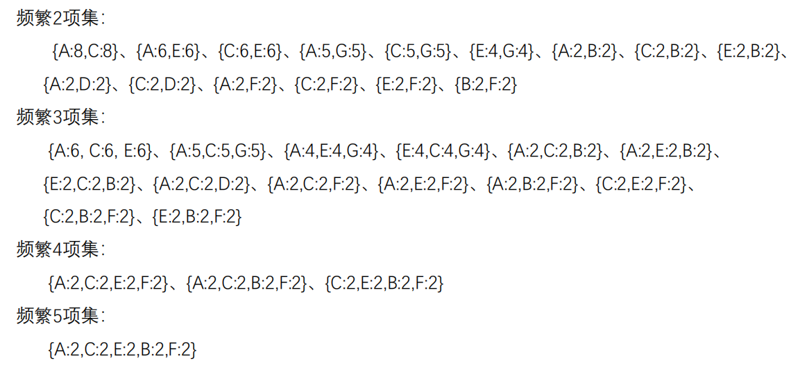

# 关联规则

‍

### 1.Apropri

	Apriori算法是常用的用于挖掘出数据关联规则的算法，它用来找出数据值中频繁出现的数据集合，这些找出的集合有助于我们的业务决策，同时我们也可以认为这些频繁出现的数据集合中的数据项存在一定的关联性，简而言之，可以认为这些数据项之间存在某种“相似性”。

	关联规则场景中的一些概念：

1. **交易集**：包含所有数据的一个数据集合，数据集合中的每条数据都是一笔交易
2. **项**：交易集中的每个商品被成为一个项
3. **模式/项集(ItemSet)** ：项组合被成为模式/项集
4. **支持度(Support)** ：一个项集在在整个交易集中出现的次数/出现的频度，比如:Support({A,C})=2表示A和C同时出现的次数是2次
5. **最小支持度**：交易次数支持度达到最小支持度的情况下，该项集才会被计算
6. **频繁项集**：如果项集的支持度大于等于最小支持度，那么该项集被成为频繁项集
7. **置信度(Confidence)** ：关联规则左件和右件同时出现的频繁程度，该值越大，表示同时出现的几率越大；
8. **关联规则**：LHS  RHS(confidence) -----> 如果客户购买了左件(LHS)，也可能购买右件(RHS)，购买的置信度为confidence

	比如：在购物数据中，啤酒对应尿布的置信度为70%，支持度为30%。则意味着在所有购物数据中，总共有30%的用户既买啤酒又买尿布；同时在买啤酒的用户中有70%的用户购买尿布。

	**Apriori算法**：

		输入：数据集合D，支持度阈值α；输出：最大的频繁K项集

1. 扫描整个数据集，得到所有出现过的1项集，得到候选频繁1项集。
2. 令k = 1
3. 挖掘频繁k项集

		扫描数据计算候选频繁k项集的支持度

		去除候选频繁k项集中支持度低于阈值的数据集，得到频繁k项集。如果得到的频繁k项集为空，则直接返回频繁k-1项集的集合作为算法结果，算法结束。如果得到的频繁k项集只有一项，则直接返回频繁k项集的集合作为算法结果，算法结束。

		**基于频繁k项集和频繁1项集，连接生成候选频繁k+1项集。（因为如果一个商品（或者一个相集）在上一个相集中的支持度小于最小支持度，则作为下一个相集的元素，在下一个相集中的支持度也必然少于最小支持度。）**

4. k=k+1，转入步骤3。

	

	

### 2.FP Growth

	Apriori算法作为挖掘频繁项集的算法，需要多次扫描数据，I/O瓶颈比较高，为了解决这个问题，提出了FP-Tree算法，也称为FP Growth算法；**在FP Tree算法中，不管存在多少数据量、不管频**

**繁K项集的K多大，只需要扫描两次数据集（第一构建FP树，第二次找条件模式基），因此提高了算法的运行效率。**

#### 	2.1 FP树的一些概念

	FP Tree算法中的**数据储存结构**，主要包含三个部分：

		**项头表**：记录所有频繁1相集以及出现的次数，按照次数降序排列。

		**FP Tree**：将原始数据集映射到内存中的一棵FP树。

		**节点链表**：是在项头表中存储的一个链表，链表中存储的是具体在FP Tree中存储的对应节点位置。

	FP Tree算法可以分为一下两个**过程**：

		项头表和FP Tree的构建(同时构建节点链表)

		FP Tree的挖掘

#### 	2.2 FP树的构建和挖掘

	FP Tree树的**构建过程**，主要分为两个过程：

1. 扫描数据，对于每条数据删除非频繁的1项集，并按照支持度降序排列(按照项头表)，得到排序后的数据集。

2. 将排序好的数据直接插入到建FP Tree。初始状态FP树是空的，建立FP树时我们一条条的读入排序后的数据集，插入FP树，插入时按照排序后的顺序，插入FP树中，排序靠前的节点是祖先节点，而靠后的是子孙节点。如果有共用的祖先，则对应的公用祖先节点计数加1。插入后，如果有新节点出现，则项头表对应的节点会通过节点链表链接上新节点。直到所有的数据都插入到FP树后，FP树的建立完成。

	下面以一个例子，来描述FP Tree的构建过程：

		数据如下：

		树的构建结果如下：

	FP算法的**挖掘过程**：

	当构建好FP树、项头表以及节点链表后，就可以开始进行频繁项集的挖掘了。首先**从项头表的底部项依次向上挖掘**，对于项头表对应于FP树的每一项，**找出对应的条件模式基**，所谓**条件模**

**式基是以我们要挖掘的节点作为叶子节点所对应的FP子树**，得到这个FP子树，我们将子树中**每个非叶子节点的的计数设置为其所有叶子节点的计数和**，然后求每个项的总的计数和，并且删

除计数低于支持度的节点。从这个条件模式基，我们就可以递归挖掘得到频繁项集了。

	条件模式基的计算示例如下（仅计算一个，其余的方法相同）：

	FP算法**最终计算结果**：

	

#### 	2.3 FP-Growth算法总结

	FP-Tree**算法流程**如下：

		1.扫描数据，得到所有的频繁1项集的计数，然后删除支持度低于阈值的项，将1项频繁集放入项头表，并按照支持度降序排列。

		2.读取数据集中的每条数据，将每条数据中的非频繁1项集(项)删除，并按照项头表中的项顺序对项进行排列，然后将排列后的数据插入到FP树中，插入时按照排序后的顺序插入，**并计算当前节点的后序子孙节点的数目（在出入数据的时候统计）** 。直到所有数据均插入到FP树后，FP树构建完成。从项头表的底部项依次向上找到项头表项对应的条件模式基。从条件模式基递归挖掘得到项头表项项的频繁项集。

		3.如果不限制频繁项集的项数，则返回上一步骤的所有的频繁项集，否则只返回满足项数要求的频繁项集。
