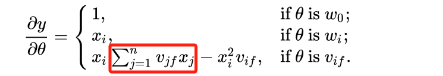

# FM因子分解机

## 1.FM基本概念

由于LR模型假设特征之间是相互独立的，忽略了特征之间关系等高阶信息；在LR中，特征组合等高阶信息是通过特征工程在特征侧引入的，比如多项式扩展+LR、GBDT+LR等方式。其中，Poly2(Degree-2 Polynomial Margin)其实就是将多项式扩展的特征工程操作直接嵌入到模型中$y(x)=w_0+\sum_{i=1}^nw_ix_i+\sum_i^n\sum_{j=i+1}^n w_{ij}x_ix_j$，但是Poly2中有一个**非常严重的问题**就是：只有当两个特征组合项(xi和xj)均为非零值的时候，该组合特征才有意义，但是在本身就数据稀疏的业务场景中，该算法的的训练效果是不尽人意的。(因为稀疏数据可能会导致某些参数训练次数过少，效果不理想。）	

实际上FM算法只是将Poly2算法中的组合特征权重转换为两个向量的内积$y(x)=w_0+\sum_{i=1}^nw_ix_i+\sum_{i=1}^{n-1}\sum_{j=i+1}^n <V_i,V_j>x_ix_j$，也就是说针对每个特征属性都训练其对应的特征向量/隐特征向量，通过这种方式就可以解决Poly2算法特征稀疏导致模型训练完成后效果差的问题；所以FM的主要优缺点如下：

	优点1：FM的隐向量的加入，大大加大了模型的泛化能力，因为不同交叉特征中的相同特征的隐向量共享，所以不会因为数据稀疏导致隐向量的训练不够充分；

	优点2：FM的时间复杂度不高，训练和推理均可以达到O(kn)的级别；

	优点3：参数量减少；

	优点4：能够解决冷启动的召回问题；针对新用户，直接在线调用模型计算用户特征向量即可；针对新商品，直接在商品录入的时候，调用模型获取物品特征向量，并将特征向量保存到数据库即可。

	缺点1：特征和不同类型特征组合的时候只能使用同一组特征隐向量；

	缺点2：解释性不强；

## 2.FM计算效率的优化--O(kn）

从上述公式可以看出$y(x)=w_0+\sum_{i=1}^nw_ix_i+\sum_{i=1}^{n-1}\sum_{j=i+1}^n <V_i,V_j>x_ix_j$的时间复杂度是$O(n^2)$,但是我们通过一系列数学运算，可以将复杂度降低为$O(kn)$。前向计算公式改写如下：

$$
\sum_i^n\sum_{j=i+1}^n <V_i,V_j>x_ix_j
$$

$$
=\frac{1}{2}(\sum_{i=1}^n\sum_{j=1}^n <V_ix_i,V_jx_j>-\sum_{i=1}^n<V_ix_i,V_ix_i>)
$$

$$
=\frac{1}{2}(\sum_{i=1}^n\sum_{j=1}^n \sum_{f=1}^k v_{if}x_iv_{jf}x_j-\sum_{i=1}^n\sum_{f=1}^k(v_{if}x_i)^2)
$$

$$
=\frac{1}{2}\sum_{f=1}^k((\sum_{i=1}^n v_{if}x_i)^2-\sum_{i=1}^n(v_{if}x_i)^2)
$$

从前向来看经过了kn次循环，从反向传播来看，对于红色方框部分相同f共享一个，而一个f需要n次循环，一共有k个不同的f所以时间复杂度为$O(kn)$：

    

## 3.FM向量召回

对于FM公式，我们可以改写如下：

$$
y(x)=w_0+\sum_{i=1}^nw_ix_i+\frac{1}{2}\sum_{f=1}^k((\sum_{i=1}^n v_{if}x_i)^2-\sum_{i=1}^n(v_{if}x_i)^2)
$$

$$
=y(x)=w_0+\sum_{u_i \in user}w_{u_i}x_{u_i}+\sum_{i_i \in item}w_{i_i}x_{i_i}+\frac{1}{2}reduce\_sum((\sum_{u_i \in user}v_{u_i}x_{u_i}+\sum_{i_i \in item}v_{i_i}x_{i_i})^2-\sum_{u_i \in user}(v_{u_i}x_{u_i})^2-\sum_{i_i \in item}(v_{i_i}x_{i_i})^2)
$$

对同一个用户来说，偏置部分和用户侧特征相关部分对召回时整体的序没有影响，可以从公式中去掉：

$$
=\sum_{i_i \in item}w_{i_i}x_{i_i}+\frac{1}{2}reduce\_sum((\sum_{u_i \in user}v_{u_i}x_{u_i}+\sum_{i_i \in item}v_{i_i}x_{i_i})^2-\sum_{i_i \in item}(v_{i_i}x_{i_i})^2)
$$

$$
=\sum_{i_i \in item}w_{i_i}x_{i_i}+\frac{1}{2}reduce\_sum((\sum_{u_i \in user}v_{u_i}x_{u_i})^2+(\sum_{i_i \in item}v_{i_i}x_{i_i})^2+2(\sum_{u_i \in user}v_{u_i}x_{u_i})(\sum_{i_i \in item}v_{i_i}x_{i_i})-\sum_{i_i \in item}(v_{i_i}x_{i_i})^2)
$$

继续去掉只与用户相关的项：

$$
=\sum_{i_i \in item}w_{i_i}x_{i_i}+\frac{1}{2}reduce\_sum((\sum_{i_i \in item}v_{i_i}x_{i_i})^2-\sum_{i_i \in item}(v_{i_i}x_{i_i})^2+2(\sum_{u_i \in user}v_{u_i}x_{u_i})(\sum_{i_i \in item}v_{i_i}x_{i_i}))
$$

Item和User的向量可表示为：

    

	（注：代码中将前面拼接的标量部分删除，计算的是近似的用户和商品向量。）

## 4.FFM

	在FM的基础上引入域的概念，相当于**将n个特征属性划分为f个域**，每个特征每个域学习一个隐向量，这样模型的表达能力会更强，但是由于隐向量和域相关，也就是和特征属性相关，所以

没办法简化，FFM的时间复杂度为O(kn^2)，一般在稍微大一点的公司都没办法使用该模型。（解决缺点一）

    

